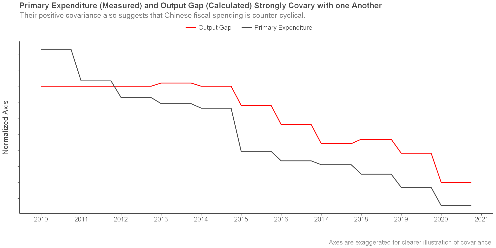
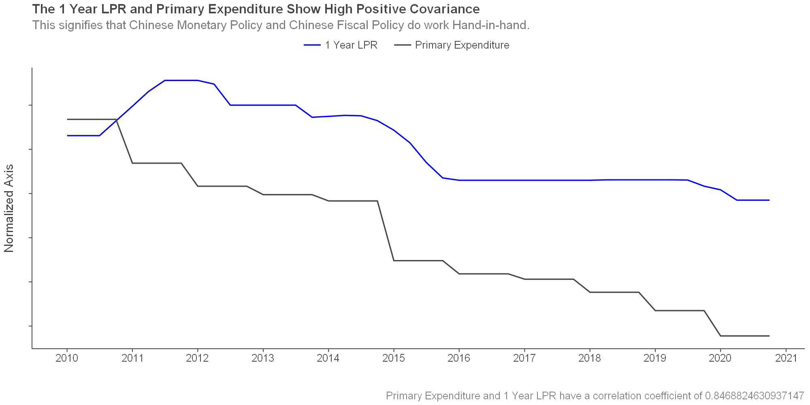

# Central Banking Society Data Work:

Hello! This is my repository for doing data analysis for the LSESU's Central Banking Society!

# Current Projects I'm Working On:

## Why does verbal intervention not work as well for China's foreign exchange as it does for other countries?

My part of the paper is to study whether there is fiscal and monetary policy co-ordination within China to test the claim that one of the reasons that verbal intervention is ineffective is due to poor co-ordination by the Chinese Government and the PBoC.

### Methodology:

+ We will be examining the correlations of fiscal and monetary policies through the following variables:
  + 1 Year LPR Rate,
  + Unemployment Rate, Nominal GDP (Output Gap),
  + Inflation,
  + Primary Expenditure,
  + Debt.

+ We'll be testing whether:
  + The 1 Year LPR Rate covaries with the Output Gap and Inflation (Taylor Rule).
  + The Primary Expenditure covaries with the Output Gap and Debt (Fiscal Policy Response Function).

### Data Sources:

+ IMF
+ PBoC
+ Chinese National Department of Statistics
+ Bank of International Settlements
+ Federal Reserve Economic Data

### Results:

Our results suggest that there is co-ordination between the PBoC and Chinese Government in the implementation of policies, especially when it comes to tackling unemployment and the output gap.

We find that primary expenditure greatly covaries with the output gap (and indirectly with the unemployment rate) and that primary expenditure is counter-cyclical, which is supported by studies such as [(Fuest, C. 2015)](https://oxfordtax.sbs.ox.ac.uk/files/wp15-14pdf).

We posit that since the covariance of both the 1 Year LPR and the Primary Expenditure is very high with the output gap (Rsquared values of 0.934 and 0.834 respectively), that both work in-tandem together.

We find that the Chinese government is slightly indifferent to the debt levels, showing a slight positive covariance between previous debt and primary expenditure (meaning that they cut do tighten budgets when debt levels are high).
